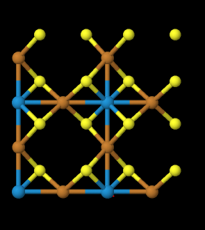

# Possible ion conductors

### B2S3 (2 different phases)

[mp-572670](https://materialsproject.org/materials/mp-572670)

[mp-866066](https://materialsproject.org/materials/mp-866066)

### CoO2 (not layered)
[mvc-14149](https://materialsproject.org/materials/mvc-14149)

### Cu2WS4
[mp-8976](https://materialsproject.org/materials/mp-8976)

### SnI2 (not layered)
[mp-978846](https://materialsproject.org/materials/mp-978846)

